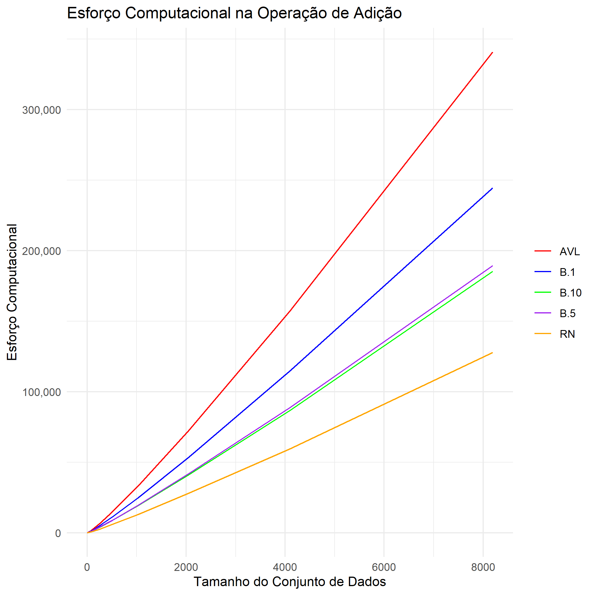
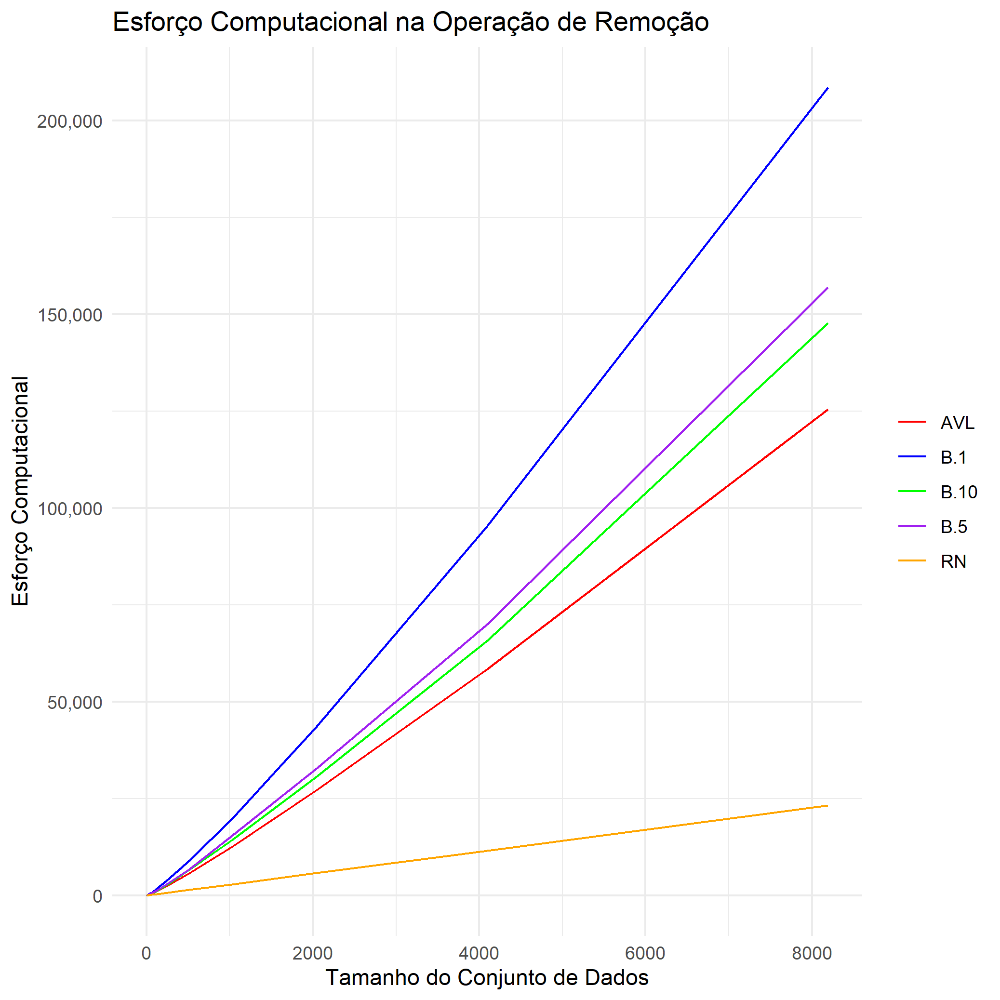

# Análise dos Gráficos de Esforço Computacional

Este projeto analisa o esforço computacional necessário para realizar operações de **adição** e **remoção** em diferentes tipos de árvores balanceadas: **Árvore Rubro-Negra (RN)**, **Árvore AVL**, e **B-árvores**, para diferentes tamanhos de conjuntos de dados. Os testes foram realizados utilizando conjuntos de dados variando entre **1 e 10.000 elementos**, e cada conjunto foi testado **10 vezes** para garantir a consistência dos resultados. Os resultados são analisados a partir de gráficos que comparam o esforço computacional necessário para cada operação e estrutura de árvore.

## 1. Análise do Esforço Computacional na Operação de Adição

### Resultados da Operação de Adição:
Ao analisar os dados de adição, observa-se que o **esforço computacional** aumenta conforme o crescimento do conjunto de dados, apresentando variações entre os tipos de árvore.

#### Observações:
1. **Árvore Rubro-Negra (RN)**:
   - A **Rubro-Negra** apresenta o **menor esforço computacional** entre todas as árvores. Isso se deve ao seu algoritmo de balanceamento eficiente, que permite uma inserção mais rápida, especialmente para conjuntos de dados menores. A curva de esforço cresce de maneira **suave** com o aumento do conjunto de dados, refletindo a eficiência da estrutura, mesmo em conjuntos maiores de dados.

2. **Árvore AVL**:
   - A **Árvore AVL** exige um **maior esforço** em relação à Rubro-Negra, especialmente à medida que o tamanho do conjunto de dados cresce. Isso ocorre devido ao método de balanceamento, que exige mais verificações e rotações a cada operação de inserção. A curva de esforço da AVL cresce de forma **mais acentuada** que a da Rubro-Negra, indicando que ela é mais custosa à medida que o conjunto de dados aumenta.

3. **B-Árvores (B-1, B-5, B-10)**:
   - Embora as B-árvores possam parecer mais complexas devido ao seu algoritmo de balanceamento, elas na realidade exigem **menos esforço computacional** para a operação de adição do que a Árvore AVL, conforme os dados do gráfico. A estrutura das B-árvores é eficiente para manter a ordenação em grandes volumes de dados, e o número de filhos por nó pode distribuir o esforço de balanceamento de forma mais equilibrada, resultando em um menor custo computacional em comparação com a AVL.

#### Resumo:
- **Rubro-Negra (RN)**: Menor esforço computacional e crescimento suave da curva.
- **AVL**: Maior esforço que a Rubro-Negra, especialmente com grandes conjuntos de dados.
- **B-árvores (B-1, B-5, B-10)**: Menor esforço computacional que a AVL, com um crescimento de curva mais acentuado para ordens maiores.

### Gráfico de Adição

### Resultados da Operação de Remoção:
Os resultados da operação de remoção seguem uma tendência semelhante à da operação de adição. O esforço computacional aumenta com o tamanho do conjunto de dados, mas com diferenças específicas dependendo da estrutura da árvore.

#### Observações:
1. **Árvore Rubro-Negra (RN)**:
   - Assim como na adição, a **Rubro-Negra** apresenta o **menor esforço computacional** nas operações de remoção. Isso é consistente com a alta eficiência da estrutura, que, devido ao seu balanceamento, não exige muitas reestruturações durante a remoção de elementos. A curva de remoção também apresenta um crescimento **suave**, refletindo a eficiência da operação de remoção nesta estrutura.

2. **Árvore AVL**:
   - A **Árvore AVL** apresenta um **maior esforço** de remoção em comparação com a Rubro-Negra. Como a operação de remoção envolve a reorganização dos nós e verificações de balanceamento, a curva de esforço da AVL cresce de forma **mais íngreme** do que a da Rubro-Negra. Isso reflete a maior complexidade de balanceamento envolvida na remoção de elementos.

3. **B-Árvores (B-1, B-5, B-10)**:
   - As **B-árvores** exigem um **maior esforço computacional** nas operações de remoção. A remoção de elementos em uma B-árvore implica na reorganização de múltiplos nós e na manutenção do balanceamento da estrutura. Isso torna a operação de remoção em B-árvores mais custosa em termos computacionais. A curva de esforço para as B-árvores segue um crescimento **mais acentuado**.

#### Resumo:
- **Rubro-Negra (RN)**: Menor esforço computacional nas remoções, com crescimento suave da curva.
- **AVL**: Maior esforço que a Rubro-Negra, especialmente para grandes conjuntos de dados, devido ao balanceamento.
- **B-Árvores (B-1, B-5, B-10)**: Maior esforço computacional, com crescimento mais acentuado devido à complexidade do balanceamento.

### Gráfico de Remoção

## Conclusões Gerais:
- A **Árvore Rubro-Negra** é a estrutura mais eficiente em termos de esforço computacional, tanto para adição quanto para remoção, apresentando o menor custo e um crescimento suave à medida que o tamanho do conjunto de dados aumenta.
- A **Árvore AVL** apresenta maior complexidade em relação à Rubro-Negra, com o esforço aumentando de forma mais acentuada conforme `n` cresce. A AVL é eficiente para conjuntos menores, mas se torna mais custosa à medida que os dados aumentam.
- As **B-árvores** são mais eficientes para **adição** devido à sua estrutura com múltiplos filhos por nó, o que facilita o balanceamento. No entanto, a **remoção** é mais custosa, pois exige reorganizar múltiplos nós para manter a ordem. Mesmo com esse custo, as B-árvores são vantajosas para grandes volumes de dados com adições frequentes.

